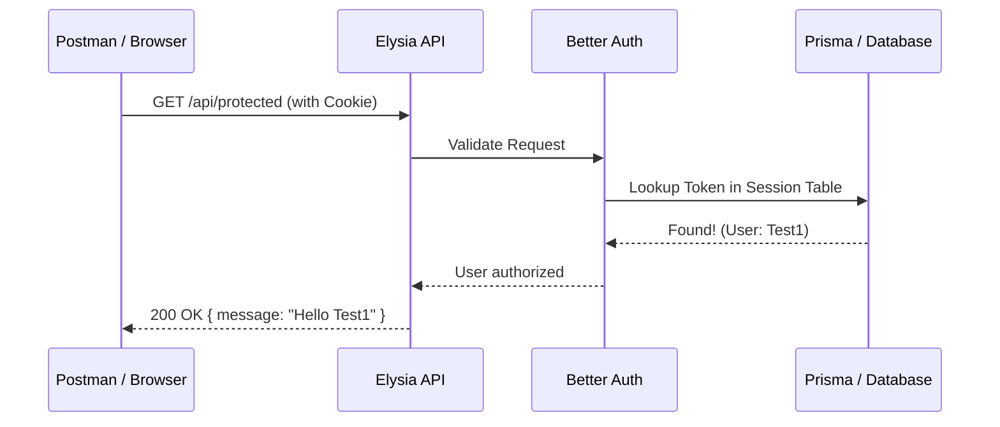

# Deep Dive: The Better Auth Authentication Flow

Checking your Postman cookies was a smart move! You've spotted some key security implementation details. Here is the step-by-step breakdown of what happens from the moment click "Sign Up" or "Login."

---

## 1. The Credentials Flow

### Phase A: Sign Up
1.  **Submission**: You send your email/password to `/api/auth/sign-up/email`.
2.  **Hashing (Argon2/Scrypt)**: Better Auth **never** stores your password as plain text. It uses a modern hashing algorithm with a "salt" to transform your password into a long, irreversible string.
3.  **Database Storage**: A new row is created in the `User` table.

### Phase B: Log In
1.  **Comparison**: When you log in, Better Auth takes the password you just sent, applies the same hashing algorithm, and compares the result to the hash stored in the DB.
2.  **Success**: If they match, the "Session Generation" phase begins.

---

## 2. Session Generation & Database
Unlike JWTs (JSON Web Tokens), which store all data inside the token itself, Better Auth uses **Database Sessions** by default.

1.  **Token Generation**: Better Auth generates a cryptographically secure, random string (e.g., `fjG2C...`). This is the "Session Token."
2.  **Session Record**: Better Auth creates a new row in your `Session` table:
    - **`id`**: Unique ID.
    - **`token`**: The random string.
    - **`userId`**: Links the session to you.
    - **`expiresAt`**: Sets the death-date of the session (7 days out by default).

---

## 3. The Cookie: `better-auth.session_token`

This is the "ID Card" that the browser carries back and forth.

### Why `HttpOnly: true`?
This is a critical security feature. It means **JavaScript cannot read this cookie**. 
- Even if a hacker successfully runs a malicious script (XSS) on your site, they cannot use `document.cookie` to steal your session token. Only the browser's networking engine can see it.

### Why `Secure: false`?
The `Secure` flag tells the browser: "Only send this cookie over an encrypted HTTPS connection."
- **In Development**: You are using `http://localhost`. If Better Auth set `Secure: true` now, the browser would **refuse to send the cookie**, and you would always appear logged out.
- **In Production**: Better Auth automatically detects if you are on `https` and will set this to `true` automatically.

### Why the 7-day Expiration? (March 21st)
Better Auth defaults to a 7-day session duration.
- You can change this in `auth.ts` using the `session.expiresIn` option.
- When the 21st arrives, the cookie becomes invalid, and the browser deletes it. The server will also reject the token because its `expiresAt` in the database has passed.

---

## 4. The Request/Response Loop

### Summary of Benefits
1.  **Revocability**: Because the session is in the database, you can "Logout of all devices" by simply deleting all rows in the `Session` table for a specific `userId`.
2.  **Security**: The combination of `HttpOnly` and server-side validation makes it extremely difficult to hijack an account.
3.  **Performance**: Better Auth caches these sessions in memory after the first lookup so it doesn't hit your database on every single tiny request.
