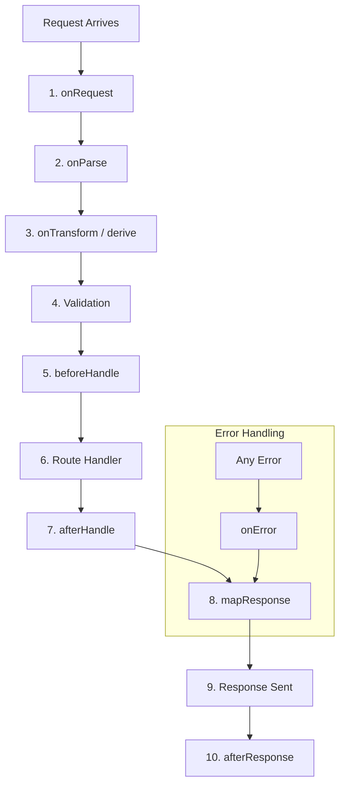

# Elysia Request Lifecycle (Simplified Mental Model)

Elysia’s request lifecycle is not a single linear pipeline like Express middleware. Instead, it is a sequence of **distinct stages**, each specialized for a specific task.

---

## 1. High-Level Flow

---

## 2. The 10 Lifecycle Stages

### 1️⃣ `onRequest`
Runs immediately when a request arrives, before everything else.
- **Common Uses**: Rate limiting, Geo-blocking, Global logging, CORS.
- **Rule**: If you return a value here, the rest of the lifecycle is skipped.

### 2️⃣ `onParse`
Equivalent to "body parsing" in Express.
- **Responsibilities**: Converting the raw binary stream into JSON, Text, or Form-Data.
- **Customization**: You can disable it with `parse: "none"` if an external library (like Better Auth) needs to handle the raw stream.

### 3️⃣ `onTransform` / `derive`
Runs before validation to prepare/mutate data.
- **Transform**: Modify existing data (e.g., converting a string ID in URL to a Number).
- **Derive**: Create new properties for the context (e.g., extracting a `userId` from a session).

| Feature | When Executed |
| :--- | :--- |
| **decorate** | Once at server start |
| **derive** | Every single request |

### 4️⃣ `Validation`
Elysia automatically validates the `body`, `query`, `params`, and `headers` against your defined schemas (TypeBox/Zod). 
- *If validation fails, the request skips to `onError`.*

### 5️⃣ `beforeHandle`
The "Security Guard" phase.
- **Common Uses**: Authentication checks, Permission/RBAC checks.
- **Rule**: If you return something (like an error), the main Route Handler is skipped.

### 6️⃣ `Route Handler`
This is your actual endpoint logic (e.g., `.get("/", () => "Hello")`).

### 7️⃣ `afterHandle`
Runs after the handler returns a value but before it's sent to the client.
- **Common Uses**: Setting custom headers, wrapping the response in a standard metadata object.

### 8️⃣ `mapResponse`
Converts the returned value into a Web Standard **Response** object.
- **Common Uses**: Compression, custom serialization, or handling file streams.

### 9️⃣ `onError`
The Global Safety Net. It captures validation errors, network errors, or crashes at any stage.

### 🔟 `afterResponse`
Runs **after** the client has received the data.
- **Common Uses**: Async cleanup, analytics, or background metrics. It **cannot** modify the response.

---

## 3. Hook Scopes

| Type | Application | Example |
| :--- | :--- | :--- |
| **Local Hook** | Single Route only | `.get("/", handler, { beforeHandle: ... })` |
| **Interceptor Hook** | All routes registered *after* it | `.onBeforeHandle(...)` |

> [!WARNING]
> Hooks only affect routes declared **after** them in the chain.

---

## 4. Final Sequence Summary

1.  `onRequest`
2.  `onParse`
3.  `onTransform` → `derive`
4.  **Validation**
5.  `beforeHandle` → `resolve`
6.  **Route Handler**
7.  `afterHandle`
8.  `mapResponse`
9.  **Response Sent**
10. `afterResponse`