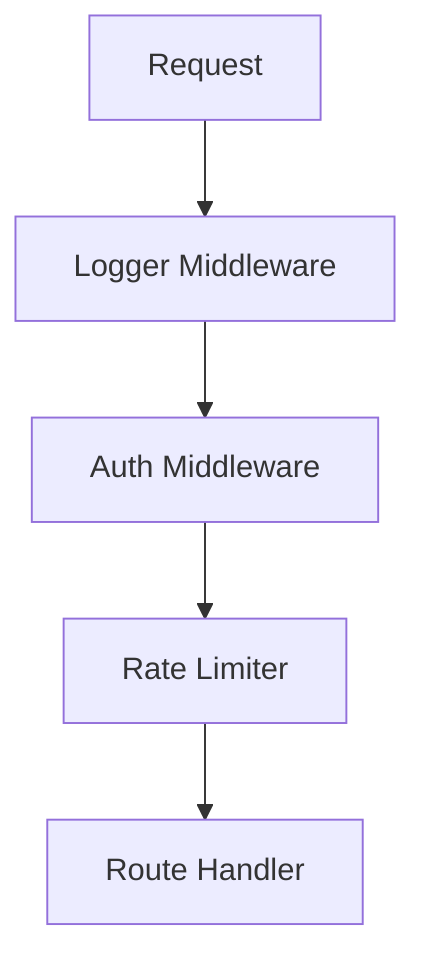

# Elysia Lifecycle vs. Traditional Frameworks

Elysia’s lifecycle is designed very differently from Express, Fastify, or Koa. This architecture is the primary reason for its industry-leading performance.

> [!IMPORTANT]
> **The Big Idea**: Elysia **compiles** the request pipeline ahead of time instead of executing middleware dynamically at runtime.

---

## 1. Traditional Frameworks (Express / Koa)

In Express, every request goes through a **runtime middleware chain**.



### The Runtime Overhead
In these frameworks, each middleware must manually:
1.  Execute its logic.
2.  Call `next()`.
3.  Pass control to the next function.

This means for every request, the engine executes a chain like: `function1() -> function2() -> function3()`. Even if a specific route (like `/public`) doesn't need auth, the middleware often still runs or must be manually scoped, adding constant branching and overhead.

---

## 2. Elysia’s Compiled Model

Elysia does not run middleware like a chain. Instead, it builds a **compiled lifecycle pipeline** for every single route.

When you define your app like this:
```typescript
new Elysia()
  .onRequest(rateLimit)
  .derive(getUser)
  .beforeHandle(authCheck)
  .get('/users', handler)
```

Elysia's JIT (Just-In-Time) compiler builds a single, optimized execution function conceptually like this:

```javascript
function compiledRoute(request) {
  rateLimit();      // Standardized Stage
  const user = getUser(); // Optimized Stage
  authCheck();      // Security Stage
  return handler(); // Execution Stage
}
```

### Benefits:
- **Zero Middleware Traversal**: No array of functions to loop through.
- **No `next()` calls**: Direct function calls are much faster for the engine to optimize.
- **No Runtime Chaining**: The "path" is already carved before the first request arrives.

---

## 3. Per-Route Optimization

Each route gets its own tailored pipeline.

```typescript
const app = new Elysia()
  .onRequest(rateLimit)
  .get('/public', publicHandler)
  .get('/admin', adminHandler, {
    beforeHandle: adminAuth
  })
```

**Compiled Pipelines**:
- **`/public`**: `rateLimit -> publicHandler`
- **`/admin`**: `rateLimit -> adminAuth -> adminHandler`

Notice that `adminAuth` is **never even considered** for the `/public` route. In Express, the middleware would still likely trigger and check the path, or require complex `app.use('/admin', ...)` scoping.

---

## 4. Body Parser Optimization

Elysia uses schemas to pre-determine exactly which parser to use.

```typescript
.post('/login', handler, {
  body: t.Object({
    username: t.String(),
    password: t.String()
  })
})
```

**Elysia sees the schema and knows it's an object.** It compiles a **JSON-only** parser for this route. 
Traditional frameworks often check headers and try multiple parsers (`if JSON? else if TEXT? else if Form?`) for every request, which adds significant branching.

---

## 5. Static Context Layout

The Context object in Elysia is compiled and strictly typed. Access to `ctx.body`, `ctx.headers`, and `ctx.query` is direct and predictable. This allows the V8 engine (and Bun's engine) to perform highly efficient memory lookups compared to the generic "backpack" style objects in Express.

---

## 6. Comparison Table

| Feature | Express / Fastify | ElysiaJS |
| :--- | :--- | :--- |
| **Middleware** | Runtime Chain | Ahead-of-Time Compiled |
| **Body Parsing** | Runtime Detection | Predefined via Schema |
| **Route Execution** | Dynamic Traversal | Static Optimzed Pipeline |
| **Context** | Generic Objects | Strictly Typed / Pre-allocated |
| **Hooks** | Executed Sequentially | Route-Specific Optimization |

---

## ⚡ Conclusion

Elysia treats your server like an **optimized execution graph**, not a middleware chain.

Instead of:
`Request → Middleware → Middleware → Handler`

It becomes:
`Request → Optimized Pipeline → Handler`